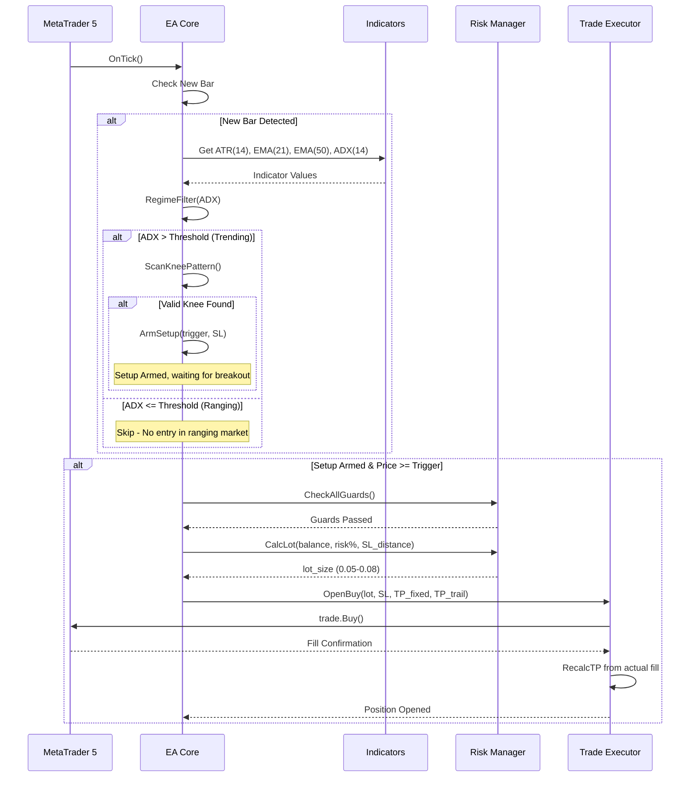
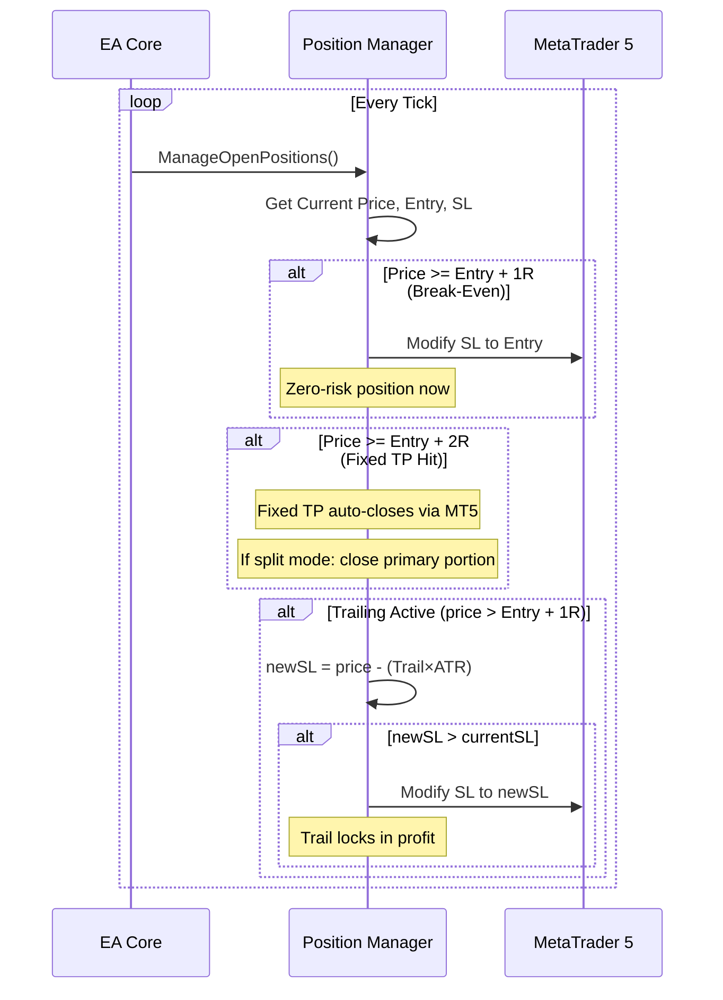
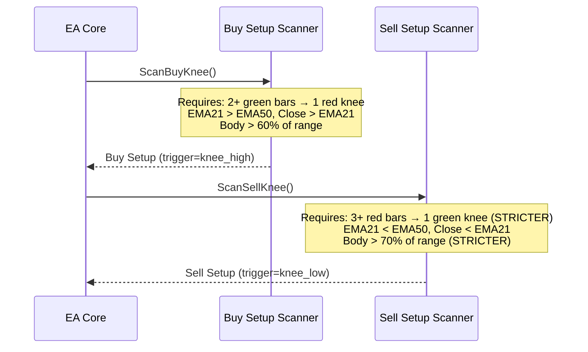

# Design Document: XAUUSD Prop Firm EA (Hybrid V20 + Trailing)

## Overview

This Expert Advisor combines the MT5-verified V20 Knee Breakout strategy (PF 1.49, $4,456 profit) with the trailing stop concept from the BEST strategy (6×ATR trail for big winners), while adding regime detection to reduce losses in ranging markets. The goal is to pass a Goat Funded Trader 5K 2-Step prop firm challenge (Phase 1: 10% profit, Phase 2: 5% profit) with strict drawdown limits (<5% daily, <10% total).

The key innovation is a **hybrid exit system**: fixed TP at RR 2.0 for the primary position portion, with a trailing stop component that lets a portion of the position run for outsized winners. Additionally, an ADX-based regime filter prevents entries during low-momentum ranging conditions — the primary failure mode identified across 105 real trades.

The EA trades XAUUSD on M5 timeframe with lot sizes constrained to 0.05–0.08, targeting $35,000 profit in 6 months from a $5,000 initial balance through compound lot growth.

## Architecture

```mermaid
graph TD
    subgraph "EA Core"
        TICK[OnTick Event] --> DAILY{New Day?}
        DAILY -->|Yes| RESET[ResetDaily - Balance/Trade Count]
        DAILY -->|No| NEXT1[Continue]
        RESET --> NEXT1
        
        NEXT1 --> TRAIL[ManageTrailingStop]
        TRAIL --> BE[ManageBreakEven]
        BE --> NEWBAR{New Bar?}
        
        NEWBAR -->|Yes| EXPIRE[Expire Old Setups]
        EXPIRE --> REGIME[RegimeFilter - ADX Check]
        REGIME -->|Ranging| SKIP[No New Setup]
        REGIME -->|Trending| ARM[TryArmSetup]
        
        NEWBAR -->|No| TRIGGER{Setup Armed?}
        ARM --> TRIGGER
        TRIGGER -->|Yes| ENTRY[CheckEntryTrigger]
        TRIGGER -->|No| END[Wait]
        
        ENTRY --> GUARDS[Pre-Trade Guards]
        GUARDS --> OPEN[OpenPosition - Hybrid Exit]
    end

    subgraph "Pre-Trade Guards"
        G1[Spread Check] --> G2[Daily Loss Limit]
        G2 --> G3[Max Trades/Day]
        G3 --> G4[Position Count]
        G4 --> G5[Day-of-Week Filter]
    end

    subgraph "Exit Management"
        E1[Fixed TP - Primary Portion]
        E2[Trailing Stop - Runner Portion]
        E3[Break-Even at 1R]
        E4[Force Close Outside Window - Optional]
    end

    subgraph "Indicators"
        I1[EMA 21 - M5]
        I2[EMA 50 - M5]
        I3[ATR 14 - M5]
        I4[ADX 14 - M5]
    end
```



## Sequence Diagrams

### Main Entry Flow



### Hybrid Exit Management Flow



### Buy + Sell Signal Detection



## Components and Interfaces

### Component 1: Risk Manager

**Purpose**: Enforces all prop firm drawdown limits and position sizing rules.

```cpp
// Risk Manager Interface
class CRiskManager
{
public:
    bool   CheckDailyLossLimit();      // Returns false if daily loss >= threshold
    bool   CheckMaxTrades();           // Returns false if max trades reached
    bool   CheckSpread();              // Returns false if spread too wide
    bool   CheckWeekday();             // Returns false on blocked days
    double CalcLotSize(double entryPrice, double stopPrice);  // Risk-based lot
    bool   IsAllowedToTrade();         // Master guard combining all checks
    void   ResetDaily();               // Called at day boundary
};
```

**Responsibilities**:
- Enforce 5% daily drawdown limit (prop firm rule)
- Enforce 10% total drawdown limit (static from initial balance)
- Calculate position size based on risk percentage and SL distance
- Track daily trade count and daily P&L
- Block trading on Thursday/Friday (data-backed)

### Component 2: Signal Generator

**Purpose**: Detects knee breakout patterns and manages setup lifecycle.

```cpp
// Signal Generator Interface
class CSignalGenerator
{
public:
    bool   ScanBuySetup();             // Looks for bullish knee pattern
    bool   ScanSellSetup();            // Looks for bearish knee pattern (stricter)
    bool   IsSetupArmed();             // Whether a valid setup is waiting
    bool   IsTriggered(double price);  // Price crossed trigger level
    void   ExpireSetup();              // Decrement bars, disarm if expired
    void   Disarm();                   // Clear setup state
    
    // Setup state
    int    direction;                  // 1=buy, -1=sell, 0=none
    double triggerPrice;               // Breakout level
    double pendingSL;                  // Calculated SL at arm time
    int    barsRemaining;              // Validity countdown
};
```

**Responsibilities**:
- Scan for valid knee breakout patterns (green run → red knee → breakout for buy)
- Apply asymmetric rules: Buy (MinRun 2, Body 60%) vs Sell (MinRun 3, Body 70%)
- Apply EMA trend filter (EMA21/50 alignment)
- Manage setup validity window (5 bars)
- Apply entry strength filter (candle body percentage)

### Component 3: Regime Filter

**Purpose**: Prevents trading during ranging/choppy market conditions.

```cpp
// Regime Filter Interface
class CRegimeFilter
{
public:
    bool   IsTrending();               // ADX-based regime classification
    double GetADXValue();              // Current ADX reading
    double GetVolatilityRatio();       // ATR(14) / ATR(50) for context
    
    // Parameters
    double adxThreshold;               // Minimum ADX for "trending" (default 20)
    bool   enabled;                    // Can disable for comparison
};
```

**Responsibilities**:
- Classify market as trending vs ranging using ADX(14)
- Optionally use volatility ratio (short ATR / long ATR) as secondary confirmation
- Prevent new setups during ranging conditions (ADX < threshold)
- Allow existing positions to be managed regardless of regime

### Component 4: Exit Manager

**Purpose**: Implements hybrid exit strategy with fixed TP + trailing stop.

```cpp
// Exit Manager Interface  
class CExitManager
{
public:
    void   ManageBreakEven(ulong ticket);   // Move SL to entry at +1R
    void   ManageTrailingStop(ulong ticket); // Trail SL behind price
    void   ManageFixedTP(ulong ticket);      // Verify TP from actual fill
    bool   ShouldForceClose(ulong ticket);   // Time-based forced exit
    
    // Configuration
    double rrFixed;                    // RR for fixed TP (2.0)
    double trailATRMultiple;          // Trail distance in ATR (6.0)
    double beOffset;                   // BE offset in points (0)
    bool   useHybridExit;             // Enable trail alongside TP
};
```

**Responsibilities**:
- Move SL to break-even when price reaches +1R profit
- Implement trailing stop at 6×ATR distance behind price
- Handle hybrid exit: TP closes at RR 2.0, but if trailing is tighter, trail takes over
- Recalculate TP from actual fill price (not trigger price)
- Optional force-close outside allowed trading window

### Component 5: Trade Executor

**Purpose**: Handles order submission, fill confirmation, and position management.

```cpp
// Trade Executor Interface
class CTradeExecutor
{
public:
    bool   OpenBuy(double lots, double sl, double tp);
    bool   OpenSell(double lots, double sl, double tp);
    bool   ModifyPosition(ulong ticket, double newSL, double newTP);
    bool   ClosePosition(ulong ticket);
    ulong  GetPositionTicket();         // Find EA's position
    int    CountPositions();            // Count EA positions
    double GetActualFillPrice(ulong ticket);
    bool   RecalcTPFromFill(ulong ticket, double sl, double rr);
};
```

**Responsibilities**:
- Submit market orders with proper fill type
- Confirm fill and verify position exists
- Recalculate TP from actual fill price (not requested price)
- Handle slippage and deviation
- Validate stops against broker minimums
- Report diagnostics on failures

## Data Models

### Configuration Parameters

```cpp
// Input Parameters Structure
struct EAConfig
{
    // Identity
    long   magic;                      // Unique EA identifier
    
    // Risk Management
    double riskPercent;                 // Risk per trade (0.70%)
    double rrFixed;                    // Fixed RR target (2.0)
    double trailATR;                   // Trailing stop ATR multiple (6.0)
    int    maxTradesPerDay;            // Maximum entries per day (4)
    double dailyLossStopR;             // Daily loss limit in R (1.5)
    double maxLot;                     // Hard lot cap (0.08)
    double minLot;                     // Minimum allowed lot (0.05)
    
    // Entry Logic
    int    kneeMinRunBuy;              // Min green bars for buy (2)
    int    kneeMinRunSell;             // Min red bars for sell (3)
    double entryStrengthBuy;           // Min body % for buy (0.60)
    double entryStrengthSell;          // Min body % for sell (0.70)
    int    validBars;                  // Setup expiry bars (5)
    double slBufferATR;               // SL buffer as ATR fraction (0.30)
    
    // Indicators
    int    emaPeriodFast;              // Fast EMA period (21)
    int    emaPeriodSlow;             // Slow EMA period (50)
    int    atrPeriod;                  // ATR period (14)
    int    adxPeriod;                  // ADX period (14)
    double adxThreshold;              // Minimum ADX for trending (20.0)
    
    // Filters
    int    maxSpreadPoints;            // Max allowed spread (50)
    bool   skipThursday;               // Block Thursday trades (true)
    bool   skipFriday;                 // Block Friday trades (true)
    bool   useRegimeFilter;            // Enable ADX regime filter (true)
    bool   useTrailingStop;            // Enable trailing stop (true)
    bool   useBreakEven;               // Enable BE at 1R (true)
    
    // Compound Growth
    bool   compoundLots;               // Grow lots with balance (true)
    double initialBalance;             // Reference balance for compounding
};
```

**Validation Rules**:
- `riskPercent` must be in range [0.1, 2.0]
- `rrFixed` must be >= 1.5
- `trailATR` must be >= 3.0 (otherwise too tight for gold)
- `maxLot` must not exceed 0.08 (prop firm constraint)
- `adxThreshold` must be in range [15, 30]
- `kneeMinRunBuy` must be >= 2
- `kneeMinRunSell` must be >= `kneeMinRunBuy`

### Runtime State

```cpp
// EA Runtime State
struct EAState
{
    // Daily tracking
    datetime dayStart;                 // Day boundary timestamp
    double   dayStartBalance;         // Balance at day open
    double   oneRMoney;                // Dollar value of 1R today
    int      tradesToday;              // Entries taken today
    double   dailyPnL;                 // Running daily P&L
    
    // Setup state
    int      setupDirection;           // 1=buy, -1=sell, 0=none
    double   triggerPrice;             // Breakout trigger level
    double   pendingSL;                // Pre-calculated SL
    int      barsRemaining;            // Bars until setup expires
    datetime setupTime;                // When setup was armed
    datetime lastTradedSetup;          // Prevent re-entry on same setup
    
    // Position tracking
    bool     hasPosition;              // EA owns a live position
    ulong    positionTicket;           // Current position ticket
    double   entryPrice;               // Actual fill price
    bool     beApplied;                // Break-even already moved
    
    // Indicators (cached per bar)
    double   atr;                      // ATR(14) value
    double   emaFast;                  // EMA(21) value
    double   emaSlow;                  // EMA(50) value
    double   adx;                      // ADX(14) value
    
    // Diagnostics
    int      totalEntries;
    int      rejectedSpread;
    int      rejectedRegime;
    int      rejectedDailyLimit;
};
```

## Algorithmic Pseudocode

### Main Processing Algorithm

```pascal
ALGORITHM OnTickMain()
INPUT: Market tick event
OUTPUT: Trade actions (entry, modify, close)

BEGIN
  // Phase 1: Daily boundary management
  dayBoundary ← GetDayBoundary()
  IF dayBoundary ≠ state.dayStart THEN
    ResetDaily()
  END IF

  // Phase 2: Exit management (every tick)
  IF state.hasPosition THEN
    ManageBreakEven(state.positionTicket)
    IF config.useTrailingStop THEN
      ManageTrailingStop(state.positionTicket)
    END IF
  END IF

  // Phase 3: New bar logic (entry scanning)
  IF IsNewBar() THEN
    // Expire old setup
    IF state.setupDirection ≠ 0 THEN
      state.barsRemaining ← state.barsRemaining - 1
      IF state.barsRemaining ≤ 0 THEN
        Disarm()
      END IF
    END IF

    // Scan for new setup (only if no position and no armed setup)
    IF state.setupDirection = 0 AND NOT state.hasPosition THEN
      // Regime check first
      IF config.useRegimeFilter THEN
        adx ← GetADX()
        IF adx < config.adxThreshold THEN
          state.rejectedRegime ← state.rejectedRegime + 1
          RETURN  // Ranging market, skip
        END IF
      END IF

      // Try buy setup
      IF ScanBuyKnee() THEN
        ArmBuySetup()
      // Try sell setup  
      ELSE IF ScanSellKnee() THEN
        ArmSellSetup()
      END IF
    END IF
  END IF

  // Phase 4: Entry trigger check (every tick)
  IF state.setupDirection ≠ 0 AND NOT state.hasPosition THEN
    IF NOT IsAllowedToTrade() THEN RETURN END IF
    
    IF state.setupDirection = 1 AND Ask ≥ state.triggerPrice THEN
      success ← OpenBuy()
      IF success THEN Disarm() END IF
    ELSE IF state.setupDirection = -1 AND Bid ≤ state.triggerPrice THEN
      success ← OpenSell()
      IF success THEN Disarm() END IF
    END IF
  END IF
END
```

**Preconditions:**
- EA is initialized with valid indicator handles
- Symbol is XAUUSD, timeframe is M5
- Trading is enabled on the account

**Postconditions:**
- At most one position opened per tick
- All daily limits enforced before any entry
- Position exits managed regardless of entry conditions

**Loop Invariants:**
- `state.tradesToday` never exceeds `config.maxTradesPerDay`
- `state.dailyPnL` checked before every entry
- Active setup validity decrements exactly once per new bar

### Knee Pattern Detection Algorithm

```pascal
ALGORITHM ScanBuyKnee()
INPUT: Bar data from M5 chart (bars[0..11], shift 1 = most recent closed)
OUTPUT: Boolean (true if valid buy setup found)

BEGIN
  atr ← GetATR(shift=1)
  IF atr ≤ 0 THEN RETURN false END IF

  // Step 1: Current bar must be bearish (the "knee")
  knee ← bars[1]  // Most recent completed bar
  IF knee.close ≥ knee.open THEN RETURN false END IF
  
  // Step 2: Knee must not be a re-entry of same setup
  IF knee.time = state.lastTradedSetup THEN RETURN false END IF

  // Step 3: Count consecutive green bars before the knee
  greenRun ← 0
  FOR i FROM 2 TO 11 DO
    IF bars[i].close > bars[i].open THEN
      greenRun ← greenRun + 1
    ELSE
      BREAK
    END IF
  END FOR
  IF greenRun < config.kneeMinRunBuy THEN RETURN false END IF

  // Step 4: Entry strength filter (body > 60% of range for last green bar)
  lastGreen ← bars[2]
  body ← |lastGreen.close - lastGreen.open|
  range ← lastGreen.high - lastGreen.low
  IF range > 0 AND (body / range) < config.entryStrengthBuy THEN
    RETURN false
  END IF

  // Step 5: EMA trend filter
  emaFast ← GetEMA(21, shift=1)
  emaSlow ← GetEMA(50, shift=1)
  IF NOT (emaFast > emaSlow AND knee.close > emaFast) THEN
    RETURN false
  END IF

  // Step 6: Calculate trigger and SL
  trigger ← CeilToTick(knee.high)
  buffer ← config.slBufferATR × atr
  sl ← FloorToTick(knee.low - buffer)
  IF trigger ≤ sl THEN RETURN false END IF

  // Step 7: Minimum SL distance check
  slDistPoints ← (trigger - sl) / Point
  IF slDistPoints < 5 THEN RETURN false END IF

  // Arm the setup
  state.setupDirection ← 1
  state.triggerPrice ← trigger
  state.pendingSL ← sl
  state.barsRemaining ← config.validBars
  state.setupTime ← knee.time

  RETURN true
END
```

**Preconditions:**
- At least 12 bars of history available
- ATR indicator is valid and returning values
- EMA indicators are valid

**Postconditions:**
- If true: state is armed with valid trigger > SL, direction = BUY
- If false: state is unchanged
- Setup trigger is always above the knee's high

**Loop Invariants:**
- greenRun counts only consecutive bullish bars immediately before the knee
- Loop terminates on first non-green bar or end of lookback

### Sell Knee Pattern (Stricter Rules)

```pascal
ALGORITHM ScanSellKnee()
INPUT: Bar data from M5 chart (bars[0..11], shift 1 = most recent closed)
OUTPUT: Boolean (true if valid sell setup found)

BEGIN
  atr ← GetATR(shift=1)
  IF atr ≤ 0 THEN RETURN false END IF

  // Step 1: Current bar must be bullish (the "green knee" for sell)
  knee ← bars[1]
  IF knee.close ≤ knee.open THEN RETURN false END IF

  // Step 2: Not a re-entry
  IF knee.time = state.lastTradedSetup THEN RETURN false END IF

  // Step 3: Count consecutive red bars before the knee (STRICTER: min 3)
  redRun ← 0
  FOR i FROM 2 TO 11 DO
    IF bars[i].close < bars[i].open THEN
      redRun ← redRun + 1
    ELSE
      BREAK
    END IF
  END FOR
  IF redRun < config.kneeMinRunSell THEN RETURN false END IF

  // Step 4: Entry strength filter (STRICTER: body > 70%)
  lastRed ← bars[2]
  body ← |lastRed.open - lastRed.close|
  range ← lastRed.high - lastRed.low
  IF range > 0 AND (body / range) < config.entryStrengthSell THEN
    RETURN false
  END IF

  // Step 5: EMA trend filter (bearish alignment)
  emaFast ← GetEMA(21, shift=1)
  emaSlow ← GetEMA(50, shift=1)
  IF NOT (emaFast < emaSlow AND knee.close < emaFast) THEN
    RETURN false
  END IF

  // Step 6: Calculate trigger and SL
  trigger ← FloorToTick(knee.low)
  buffer ← config.slBufferATR × atr
  sl ← CeilToTick(knee.high + buffer)
  IF sl ≤ trigger THEN RETURN false END IF

  // Step 7: Minimum SL distance
  slDistPoints ← (sl - trigger) / Point
  IF slDistPoints < 5 THEN RETURN false END IF

  // Arm the setup
  state.setupDirection ← -1
  state.triggerPrice ← trigger
  state.pendingSL ← sl
  state.barsRemaining ← config.validBars
  state.setupTime ← knee.time

  RETURN true
END
```

### Hybrid Exit Algorithm

```pascal
ALGORITHM ManageTrailingStop(ticket)
INPUT: Position ticket ID
OUTPUT: SL modification (or none)

BEGIN
  IF NOT PositionSelect(ticket) THEN RETURN END IF
  
  atr ← GetATR(shift=1)
  IF atr ≤ 0 THEN RETURN END IF
  
  posType ← PositionType(ticket)
  entryPrice ← PositionOpenPrice(ticket)
  currentSL ← PositionSL(ticket)
  
  IF posType = BUY THEN
    currentPrice ← Bid
    // Only trail after break-even (price > entry + 1R equivalent)
    initialRisk ← entryPrice - currentSL
    IF initialRisk ≤ 0 THEN
      initialRisk ← entryPrice - state.pendingSL  // Fallback
    END IF
    
    // Only activate trailing after price reaches +1R
    IF currentPrice < entryPrice + initialRisk THEN RETURN END IF
    
    // Calculate new trailing SL
    newSL ← FloorToTick(currentPrice - config.trailATR × atr)
    
    // Only move SL upward
    IF newSL > currentSL AND newSL < currentPrice THEN
      // Validate minimum distance from current price
      minDist ← StopsLevel × Point
      IF (currentPrice - newSL) ≥ minDist THEN
        ModifyPosition(ticket, newSL, PositionTP(ticket))
      END IF
    END IF
    
  ELSE IF posType = SELL THEN
    currentPrice ← Ask
    initialRisk ← currentSL - entryPrice
    IF initialRisk ≤ 0 THEN
      initialRisk ← state.pendingSL - entryPrice
    END IF
    
    IF currentPrice > entryPrice - initialRisk THEN RETURN END IF
    
    newSL ← CeilToTick(currentPrice + config.trailATR × atr)
    
    IF newSL < currentSL AND newSL > currentPrice THEN
      minDist ← StopsLevel × Point
      IF (newSL - currentPrice) ≥ minDist THEN
        ModifyPosition(ticket, newSL, PositionTP(ticket))
      END IF
    END IF
  END IF
END
```

**Preconditions:**
- Position exists and is owned by this EA
- ATR indicator is valid
- Position has been filled (not pending)

**Postconditions:**
- SL only moves in profitable direction (tighter)
- SL never violates broker minimum stop distance
- TP remains unchanged (hybrid: trail catches positions that run past TP)

**Loop Invariants:**
- N/A (single execution per tick per position)

### Lot Calculation with Compound Growth

```pascal
ALGORITHM CalcLotSize(entryPrice, stopPrice)
INPUT: entryPrice (double), stopPrice (double)
OUTPUT: lot size (double, 0 if rejected)

BEGIN
  IF entryPrice ≤ 0 OR stopPrice ≤ 0 THEN RETURN 0 END IF
  IF entryPrice ≤ stopPrice AND direction = BUY THEN RETURN 0 END IF
  IF stopPrice ≤ entryPrice AND direction = SELL THEN RETURN 0 END IF
  
  balance ← AccountBalance()
  
  // Compound lot growth: risk grows with balance
  IF config.compoundLots AND config.initialBalance > 0 THEN
    growthFactor ← balance / config.initialBalance
    effectiveRisk ← config.riskPercent × growthFactor
    // Cap effective risk at 2× initial (safety)
    effectiveRisk ← Min(effectiveRisk, config.riskPercent × 2.0)
  ELSE
    effectiveRisk ← config.riskPercent
  END IF
  
  riskMoney ← balance × (effectiveRisk / 100.0)
  
  // Calculate loss per lot using OrderCalcProfit
  lossPerLot ← |OrderCalcProfit(BUY, 1.0, entryPrice, stopPrice)|
  IF lossPerLot ≤ 0 THEN
    // Fallback calculation
    tickValue ← TickValueLoss
    tickSize ← TickSize
    lossPerLot ← (|entryPrice - stopPrice| / tickSize) × tickValue
  END IF
  IF lossPerLot ≤ 0 THEN RETURN 0 END IF
  
  rawLots ← riskMoney / lossPerLot
  
  // Floor to volume step
  lots ← Floor(rawLots / volumeStep) × volumeStep
  
  // Apply caps
  lots ← Min(lots, config.maxLot)
  lots ← Min(lots, 0.08)  // Hard prop firm cap
  
  // REJECT if below minimum (never force up)
  IF lots < volumeMin THEN RETURN 0 END IF
  
  // Ensure within allowed range
  IF lots < config.minLot THEN RETURN 0 END IF
  
  RETURN NormalizeDouble(lots, volumeDigits)
END
```

**Preconditions:**
- Valid entry and stop prices with correct directional relationship
- Account balance > 0
- Symbol volume information available

**Postconditions:**
- Result is either 0 (rejected) or a valid lot in [volumeMin, 0.08]
- Lot is properly rounded to volume step
- Risk money never exceeds 2× initial risk percentage

### Regime Detection Algorithm

```pascal
ALGORITHM RegimeFilter()
INPUT: ADX(14) indicator value
OUTPUT: Boolean (true = trending, allowed to trade)

BEGIN
  adx ← GetADX(period=14, shift=1)
  IF adx ≤ 0 THEN RETURN true END IF  // Indicator failure = allow (fail-open)
  
  // Primary regime classification
  IF adx ≥ config.adxThreshold THEN
    // Trending — allow entries
    RETURN true
  END IF
  
  // Optional: Volatility context check
  // If ATR is expanding even with low ADX, market may be transitioning
  IF config.useVolatilityContext THEN
    atr14 ← GetATR(14, shift=1)
    atr50 ← GetATR(50, shift=1)
    IF atr50 > 0 AND (atr14 / atr50) > 1.3 THEN
      // Volatility expanding — possible trend starting
      RETURN true
    END IF
  END IF
  
  // Ranging — block new entries
  RETURN false
END
```

**Preconditions:**
- ADX indicator handle is valid
- At least 14 bars of data available

**Postconditions:**
- Returns true if market is suitable for knee breakout entries
- Fails open (returns true) on indicator errors
- Does not affect existing position management

## Key Functions with Formal Specifications

### Function: OpenBuy()

```cpp
bool OpenBuy()
```

**Preconditions:**
- `state.setupDirection == 1`
- `state.triggerPrice > 0` and `state.pendingSL > 0`
- `state.triggerPrice > state.pendingSL`
- `Ask >= state.triggerPrice` (trigger condition met)
- `IsAllowedToTrade() == true`
- No existing position owned by this EA

**Postconditions:**
- On success: position exists with correct SL and TP calculated from actual fill price
- On success: `state.tradesToday` incremented by 1
- On success: `state.lastTradedSetup == state.setupTime`
- On failure (permanent): setup is disarmed
- On failure (transient): setup remains armed for retry next tick
- TP = actualFill + (RR × (actualFill - SL))
- SL distance from fill >= broker SYMBOL_TRADE_STOPS_LEVEL

### Function: ManageBreakEven()

```cpp
void ManageBreakEven(ulong ticket)
```

**Preconditions:**
- `ticket` refers to a valid, open position owned by this EA
- `config.useBreakEven == true`
- Position type is known (BUY or SELL)

**Postconditions:**
- For BUY: If Bid >= entry + initialRisk, SL is moved to entry + offset
- For SELL: If Ask <= entry - initialRisk, SL is moved to entry - offset
- SL is only moved once (idempotent — subsequent calls are no-ops)
- New SL respects broker minimum stop distance
- TP is never modified by this function

### Function: CalcLotSize()

```cpp
double CalcLotSize(double entryPrice, double stopPrice)
```

**Preconditions:**
- `entryPrice > 0` and `stopPrice > 0`
- For BUY: `entryPrice > stopPrice`
- For SELL: `stopPrice > entryPrice`
- Account balance > 0

**Postconditions:**
- Returns 0 if risk calculation fails or lot is below minimum
- Returns value in range [`volumeMin`, `min(config.maxLot, 0.08)`]
- Returned value is rounded to `volumeStep`
- Actual risk if stopped = `riskPercent × balance × growthFactor` (±1 tick of rounding)
- Never forces lot upward to minimum (safety: rejects instead)

### Function: RegimeFilter()

```cpp
bool RegimeFilter()
```

**Preconditions:**
- ADX indicator handle is valid (INVALID_HANDLE checked)
- `config.adxPeriod >= 7`

**Postconditions:**
- Returns `true` if ADX >= threshold (trending market)
- Returns `true` if indicator read fails (fail-open behavior)
- Returns `false` only when ADX is confidently below threshold
- Does not modify any state

## Example Usage

```cpp
//+------------------------------------------------------------------+
//| Initialization                                                     |
//+------------------------------------------------------------------+
int OnInit()
{
    // Initialize indicator handles
    atrHandle    = iATR(_Symbol, PERIOD_M5, 14);
    emaFastHandle = iMA(_Symbol, PERIOD_M5, 21, 0, MODE_EMA, PRICE_CLOSE);
    emaSlowHandle = iMA(_Symbol, PERIOD_M5, 50, 0, MODE_EMA, PRICE_CLOSE);
    adxHandle    = iADX(_Symbol, PERIOD_M5, 14);
    
    if(atrHandle == INVALID_HANDLE || emaFastHandle == INVALID_HANDLE ||
       emaSlowHandle == INVALID_HANDLE || adxHandle == INVALID_HANDLE)
        return INIT_FAILED;
    
    // Setup trade object
    trade.SetExpertMagicNumber(InpMagic);
    trade.SetDeviationInPoints(30);
    trade.SetAsyncMode(false);
    trade.SetMarginMode();
    trade.SetTypeFillingBySymbol(_Symbol);
    
    // Initialize state
    g_initialBalance = AccountInfoDouble(ACCOUNT_BALANCE);
    ResetDaily();
    
    return INIT_SUCCEEDED;
}

//+------------------------------------------------------------------+
//| Main Tick Processing                                               |
//+------------------------------------------------------------------+
void OnTick()
{
    // Daily reset
    datetime ds = iTime(_Symbol, PERIOD_D1, 0);
    if(ds > 0 && ds != g_dayStart) ResetDaily();
    
    // Exit management (every tick)
    if(HasPosition())
    {
        ulong tk = GetPositionTicket();
        ManageBreakEven(tk);
        if(InpUseTrailing) ManageTrailingStop(tk);
    }
    
    // New bar entry logic
    if(IsNewBar())
    {
        // Expire setup
        if(g_setupDirection != 0)
        {
            g_barsRemaining--;
            if(g_barsRemaining <= 0) Disarm();
        }
        
        // Scan for new setup
        if(g_setupDirection == 0 && !HasPosition())
        {
            // Regime filter
            if(InpUseRegimeFilter && !RegimeFilter()) return;
            
            // Try buy first, then sell
            if(!ScanBuyKnee())
                ScanSellKnee();
        }
    }
    
    // Entry trigger
    if(g_setupDirection == 0 || HasPosition()) return;
    if(!IsAllowedToTrade()) return;
    
    MqlTick tick;
    if(!SymbolInfoTick(_Symbol, tick)) return;
    
    if(g_setupDirection == 1 && tick.ask >= g_triggerPrice)
    {
        if(OpenBuy()) Disarm();
    }
    else if(g_setupDirection == -1 && tick.bid <= g_triggerPrice)
    {
        if(OpenSell()) Disarm();
    }
}
```

## Correctness Properties

The following properties must hold for any valid execution of the EA:

1. **Drawdown Safety**: `∀ time t: (initialBalance - equity(t)) / initialBalance < 0.10`
   - The EA must never exceed 10% total drawdown from initial balance

2. **Daily Loss Limit**: `∀ day d: dailyLoss(d) ≤ dailyStartBalance(d) × 0.05`
   - Daily loss never exceeds 5% of day-start balance

3. **Lot Constraint**: `∀ trade t: 0.05 ≤ lots(t) ≤ 0.08`
   - Every executed trade has lot size within allowed range

4. **SL Monotonicity (Trailing)**: `∀ position p, ticks t1 < t2: SL(p, t2) ≥ SL(p, t1)` (for BUY)
   - Trailing stop never moves backward (against profit direction)

5. **BE Idempotency**: Once break-even is applied, subsequent calls produce no state change

6. **Setup Validity**: `∀ setup s: 0 < barsRemaining(s) ≤ config.validBars`
   - No setup persists beyond its validity window

7. **TP from Fill**: `TP = actualFillPrice + RR × (actualFillPrice - SL)`
   - TP is always calculated from actual fill, never from trigger price

8. **Regime Consistency**: `∀ entry e: ADX(time_of_entry) ≥ config.adxThreshold OR NOT config.useRegimeFilter`
   - No entry occurs during confirmed ranging conditions when filter is active

9. **Asymmetric Sell**: `∀ sell setup: minRun(sell) ≥ 3 AND bodyPct(sell) ≥ 0.70`
   - Sell entries are always subject to stricter criteria than buy entries

10. **Max Trades**: `∀ day d: tradeCount(d) ≤ config.maxTradesPerDay`
    - Trade count per day never exceeds configured maximum

## Error Handling

### Error Scenario 1: Spread Spike

**Condition**: `SymbolInfoInteger(SYMBOL_SPREAD) > InpMaxSpread` at trigger time
**Response**: Entry is blocked; setup remains armed
**Recovery**: Setup waits for next tick with acceptable spread (within validity window)

### Error Scenario 2: Order Execution Failure

**Condition**: `trade.Buy()` returns false or retcode indicates failure
**Response**: Check retcode category:
- Transient (requote, timeout): Keep setup armed, retry next tick
- Permanent (invalid stops, no money, invalid volume): Disarm setup
**Recovery**: Diagnostics counter incremented; log emitted

### Error Scenario 3: Position Not Found After Fill

**Condition**: `trade.ResultDeal() > 0` but `PositionSelectByTicket()` fails
**Response**: Log diagnostic, increment counter, treat as failed entry
**Recovery**: Disarm setup; do not count as trade (position may have been stopped instantly)

### Error Scenario 4: Daily Loss Limit Breached

**Condition**: Running daily P&L exceeds `dailyLossStopR × oneRMoney`
**Response**: Block all new entries for remainder of day
**Recovery**: Automatic reset at next day boundary; existing positions managed normally

### Error Scenario 5: Indicator Handle Invalid

**Condition**: CopyBuffer returns -1 or indicator returns 0
**Response**: For ATR/EMA: block setup scanning (fail-closed for entries). For ADX: allow entry (fail-open for regime filter)
**Recovery**: Re-attempt on next bar; if persistent, EA logs error state

### Error Scenario 6: Prop Firm Total DD Approaching

**Condition**: `(initialBalance - AccountEquity()) / initialBalance > 0.08` (approaching 10% limit)
**Response**: Reduce risk to 50% (halve lot size), or stop trading entirely at 9%
**Recovery**: No automatic recovery — manual intervention required or reset next challenge

## Testing Strategy

### Unit Testing Approach

Key test cases for EA logic validation in MT5 Strategy Tester:

1. **Knee Pattern Detection**: Verify correct arm/disarm behavior with known candle sequences
2. **Lot Calculation**: Test with various balance/SL scenarios, verify no over-sizing
3. **Break-Even Logic**: Verify SL moves to entry at exactly +1R, not before
4. **Trailing Stop**: Verify SL only moves in profit direction
5. **Daily Limits**: Verify trading stops after N losses in a day
6. **Regime Filter**: Verify no entries when ADX < threshold

### Property-Based Testing Approach

**Property Test Library**: Custom MQL5 test harness with random input generation

Key properties to verify:
- For any random sequence of prices, trailing SL never moves backward
- For any entry, calculated lot × SL distance ≤ risk budget (within 1 tick tolerance)
- For any market state, at most `maxTradesPerDay` entries occur per calendar day
- Entry strength filter always rejects candles with body/range < threshold

### Integration Testing Approach

1. **Full Backtest**: XAUUSD M5, Jan 2026 – Jul 2026, Every Tick mode
2. **Split Validation**: In-sample (Jan–Apr), Out-of-sample (Apr–Jul)
3. **Target Metrics**: PF > 1.5, DD < 13%, Trades > 200
4. **Comparison**: A/B test with V20 baseline (regime filter ON vs OFF)
5. **Prop Firm Simulation**: Verify Phase 1 (10% target) achievable within 30 days
6. **Stress Test**: Run on spread=50 (max allowed) to verify degradation is graceful

### Regression Tests (from known failures)

| Test | What it catches | Expected behavior |
|------|-----------------|-------------------|
| V10 over-filter | Too many filters | Verify trade count > 200 in 6 months |
| V22 H1 filter disaster | MTF kills volume | No H1/M15 filters present |
| V25 no daily limits | DD explosion | Daily loss always capped |
| V26 EMA pullback noise | Too many entries | Only knee breakout entries |

## Performance Considerations

- **Tick Processing**: ManageTrailingStop runs every tick — must be O(1) per position
- **Indicator Caching**: ATR/EMA values cached per bar (not recalculated every tick)
- **Position Count**: Single position constraint means O(1) position scanning
- **Memory**: All state is in-memory global variables; no dynamic allocation
- **Backtest Speed**: With "Every Tick" mode, aim for <30 seconds for 6-month backtest
- **Maximum Positions**: Limited to 1 active position at a time (simplifies management, reduces DD)

## Security Considerations

- **Magic Number Isolation**: All operations check `POSITION_MAGIC == InpMagic` to avoid interfering with other EAs
- **Hard Lot Cap**: `HARD_MAX_LOT = 0.08` prevents any code path from exceeding prop firm limit
- **Daily Loss Hard Stop**: Even if BE/trail logic fails, daily loss limit prevents catastrophic loss
- **No Martingale**: Lot sizing never increases after a loss
- **Fail-Safe Disarm**: Setup expires after 5 bars regardless of market conditions
- **Input Validation**: OnInit rejects invalid parameters (negative risk, zero periods, etc.)

## Dependencies

| Dependency | Purpose | Version |
|------------|---------|---------|
| Trade/Trade.mqh | CTrade class for order management | MT5 built-in |
| iATR() | Average True Range indicator | MT5 built-in |
| iMA() | Moving Average (EMA mode) | MT5 built-in |
| iADX() | Average Directional Index | MT5 built-in |
| OrderCalcProfit() | Accurate lot-to-dollar conversion | MT5 built-in |
| SymbolInfoDouble/Integer | Broker constraints (spread, stops, volume) | MT5 built-in |

**No external libraries required.** The EA is self-contained within the MQL5 standard library.


## Correctness Properties (Updated with Requirements References)

The following properties must hold for any valid execution of the EA:

1. **Drawdown Safety**: `∀ time t: (initialBalance - equity(t)) / initialBalance < 0.10`
   - The EA must never exceed 10% total drawdown from initial balance
   - **Validates: Requirements 2.1, 2.2, 2.3, 2.4, 2.5**

2. **Daily Loss Limit**: `∀ day d: dailyLoss(d) ≤ dailyStartBalance(d) × 0.05`
   - Daily loss never exceeds 5% of day-start balance
   - **Validates: Requirements 1.1, 1.2, 1.3, 1.4, 1.5**

3. **Lot Constraint**: `∀ trade t: 0.05 ≤ lots(t) ≤ 0.08`
   - Every executed trade has lot size within allowed range
   - **Validates: Requirements 4.3, 4.5, 20.3**

4. **SL Monotonicity (Trailing)**: `∀ position p, ticks t1 < t2: SL(p, t2) ≥ SL(p, t1)` (for BUY)
   - Trailing stop never moves backward (against profit direction)
   - **Validates: Requirements 6.3, 6.4, 6.5, 17.1, 17.2, 17.3, 17.4, 17.5, 17.6**

5. **BE Idempotency**: Once break-even is applied, subsequent calls produce no state change
   - **Validates: Requirements 6.2, 16.1, 16.2, 16.3, 16.4, 16.5**

6. **Setup Validity**: `∀ setup s: 0 < barsRemaining(s) ≤ config.validBars`
   - No setup persists beyond its validity window
   - **Validates: Requirements 7.1, 7.2, 7.3, 7.4, 7.5**

7. **TP from Fill**: `TP = actualFillPrice + RR × (actualFillPrice - SL)`
   - TP is always calculated from actual fill, never from trigger price
   - **Validates: Requirements 5.1, 5.2, 5.3, 5.4, 5.5**

8. **Regime Consistency**: `∀ entry e: ADX(time_of_entry) ≥ config.adxThreshold OR NOT config.useRegimeFilter`
   - No entry occurs during confirmed ranging conditions when filter is active
   - **Validates: Requirements 3.1, 10.1, 10.2, 10.3, 10.4, 10.5, 14.1**

9. **Asymmetric Sell**: `∀ sell setup: minRun(sell) ≥ 3 AND bodyPct(sell) ≥ 0.70`
   - Sell entries are always subject to stricter criteria than buy entries
   - **Validates: Requirements 3.2, 3.3, 12.1, 12.2**

10. **Max Trades**: `∀ day d: tradeCount(d) ≤ config.maxTradesPerDay`
    - Trade count per day never exceeds configured maximum
    - **Validates: Requirements 9.1, 9.2, 9.3, 9.4, 9.5**

11. **Entry Validation**: All entry conditions must be satisfied before position opening
    - **Validates: Requirements 3.4, 3.5, 13.1, 13.2, 13.3, 13.4, 13.5, 15.1, 15.2, 15.3, 15.4, 15.5**

12. **Position Management**: Single position constraint with magic number verification
    - **Validates: Requirements 15.1, 15.2, 15.3, 15.4, 15.5**

13. **Break-Even Trigger**: SL moves to entry when price reaches +1R profit
    - **Validates: Requirements 6.1, 16.1, 16.2**

14. **Trailing Activation**: Only activates after +1R profit threshold
    - **Validates: Requirements 6.3, 17.1, 17.4**

15. **Error Handling**: Diagnostic counters track specific rejection reasons
    - **Validates: Requirements 18.1, 18.2, 18.3, 18.4, 18.5**

16. **Configuration Validation**: All parameters validated on initialization
    - **Validates: Requirements 19.1, 19.2, 19.3, 19.4, 19.5**

17. **Prop Firm Compliance**: All prop firm constraints enforced
    - **Validates: Requirements 20.1, 20.2, 20.3, 20.4, 20.5**


## Correctness Properties (Complete with Requirements References)

The following properties must hold for any valid execution of the EA:

### Drawdown Properties

1. **Drawdown Safety**: `∀ time t: (initialBalance - equity(t)) / initialBalance < 0.10`
   - The EA must never exceed 10% total drawdown from initial balance
   - **Validates: Requirements 2.1, 2.2, 2.3, 2.4, 2.5**

2. **Daily Loss Limit**: `∀ day d: dailyLoss(d) ≤ dailyStartBalance(d) × 0.05`
   - Daily loss never exceeds 5% of day-start balance
   - **Validates: Requirements 1.1, 1.2, 1.3, 1.4, 1.5**

3. **Daily Loss R Limit**: `∀ day d: dailyLoss(d) ≤ 1.5R(d)` where R(d) is the average trade risk for day d
   - Daily loss never exceeds 1.5R per day
   - **Validates: Requirements 14.1, 14.2, 14.3, 14.4, 14.5**

### Entry Validation Properties

4. **Regime Consistency**: `∀ entry e: ADX(time_of_entry) ≥ config.adxThreshold OR NOT config.useRegimeFilter`
   - No entry occurs during confirmed ranging conditions when filter is active
   - **Validates: Requirements 3.1, 10.1, 10.2, 10.3, 10.4, 10.5**

5. **Spread Validation**: `∀ entry e: spread(e) ≤ 50 points`
   - All trade entries have acceptable spread
   - **Validates: Requirements 3.4, 13.1, 13.2, 13.3, 13.4, 13.5**

6. **EMA Trend Filter**: `∀ buy entry: EMA21 > EMA50 ∧ close > EMA21; ∀ sell entry: EMA21 < EMA50 ∧ close < EMA21`
   - All entries respect EMA trend alignment
   - **Validates: Requirements 12.1, 12.2, 12.3, 12.4, 12.5**

7. **Entry Strength Filter**: `∀ buy entry: bodyRange ≥ 0.60; ∀ sell entry: bodyRange ≥ 0.70`
   - All entries meet minimum candle strength requirements
   - **Validates: Requirements 3.2, 3.3**

### Position Sizing Properties

8. **Lot Constraint**: `∀ trade t: 0.05 ≤ lots(t) ≤ 0.08`
   - Every executed trade has lot size within allowed range
   - **Validates: Requirements 4.3, 4.5, 20.3**

9. **Risk Calculation**: `∀ trade t: riskMoney(t) = balance × (riskPercent × growthFactor / 100)`
   - Position sizing correctly calculates risk based on account balance
   - **Validates: Requirements 4.1, 4.2**

10. **Compound Growth Cap**: `∀ trade t: growthFactor(t) ≤ 2.0`
    - Compound growth is capped at 2× initial risk percentage
    - **Validates: Requirements 4.2**

### Stop Loss and Take Profit Properties

11. **TP from Fill**: `∀ position p: TP(p) = fillPrice(p) + RR × (fillPrice(p) - SL(p))`
    - Take profit is always calculated from actual fill price
    - **Validates: Requirements 5.1, 5.2, 5.3, 5.4, 5.5**

12. **Broker Stop Constraints**: `∀ position p: |entry(p) - SL(p)| ≥ SYMBOL_TRADE_STOPS_LEVEL`
    - All stop losses satisfy broker minimum distance requirements
    - **Validates: Requirements 5.3**

### Trailing Stop Properties

13. **SL Monotonicity (BUY)**: `∀ position p, ticks t1 < t2: SL(p, t2) ≥ SL(p, t1)` for BUY positions
    - Trailing stop never moves backward (against profit direction) for buy positions
    - **Validates: Requirements 6.3, 6.4, 6.5, 17.1, 17.2, 17.3**

14. **SL Monotonicity (SELL)**: `∀ position p, ticks t1 < t2: SL(p, t2) ≤ SL(p, t1)` for SELL positions
    - Trailing stop never moves away from price (against profit direction) for sell positions
    - **Validates: Requirements 6.3, 6.5, 17.4, 17.5, 17.6**

15. **BE Activation**: `∀ position p: SL(p) = entry(p) WHEN price reaches +1R`
    - Break-even is applied when position reaches 1R profit
    - **Validates: Requirements 6.1, 16.1**

16. **BE Idempotency**: `∀ position p, tick t: BE(p, t+1) = BE(p, t)`
    - Once break-even is applied, subsequent checks produce no state change
    - **Validates: Requirements 6.2, 16.2, 16.3, 16.4, 16.5**

17. **Trailing Activation**: `∀ position p: trailActivates WHEN price > entry + 1R`
    - Trailing only activates after +1R profit threshold
    - **Validates: Requirements 6.3, 17.1, 17.4**

### Setup Lifecycle Properties

18. **Setup Validity**: `∀ setup s: 0 < barsRemaining(s) ≤ config.validBars`
    - No setup persists beyond its validity window
    - **Validates: Requirements 7.1, 7.2, 7.3, 7.4, 7.5**

19. **Max Trades Per Day**: `∀ day d: tradeCount(d) ≤ config.maxTradesPerDay`
    - Trade count per day never exceeds configured maximum
    - **Validates: Requirements 9.1, 9.2, 9.3, 9.4, 9.5, 20.5**

20. **Day-of-Week Filter**: `∀ entry e: dayOfWeek(e) ∈ {Monday, Tuesday, Wednesday}`
    - Entries only occur on allowed days (no Thursday or Friday)
    - **Validates: Requirements 8.1, 8.2, 8.3, 8.4, 8.5**

### Single Position Properties

21. **Single Position Maximum**: `∀ time t: positionCount(t) ≤ 1`
    - The EA never holds more than one position at a time
    - **Validates: Requirements 15.1, 15.2, 15.5**

22. **Magic Number Verification**: `∀ position p: POSITION_MAGIC = config.magic`
    - All managed positions are owned by this EA
    - **Validates: Requirements 15.4**

### Initialization and Configuration Properties

23. **Indicator Validation**: `∀ indicator i: handle(i) ≠ INVALID_HANDLE`
    - All required indicator handles are valid on initialization
    - **Validates: Requirements 19.1, 19.2**

24. **Parameter Bounds**: `∀ parameter p: p ∈ validRange(p)`
    - All configuration parameters are within valid ranges
    - **Validates: Requirements 19.5**

### Prop Firm Compliance Properties

25. **Prop Firm Daily DD**: `∀ day d: dailyDrawdown(d) ≤ 5%`
    - Daily drawdown never exceeds 5% (prop firm requirement)
    - **Validates: Requirements 1.1, 1.2, 1.3, 1.4, 1.5, 20.1**

26. **Prop Firm Total DD**: `∀ time t: totalDrawdown(t) ≤ 10%`
    - Total drawdown never exceeds 10% (prop firm requirement)
    - **Validates: Requirements 2.1, 2.2, 2.3, 2.4, 2.5, 20.2**

27. **Prop Firm Timeframe**: `∀ operation o: symbol(o) = XAUUSD ∧ timeframe(o) = M5`
    - The EA only operates on XAUUSD M5 (prop firm requirement)
    - **Validates: Requirements 20.4**

### Error Handling and Diagnostics Properties

28. **Diagnostic Counters**: `∀ rejectionType r: counter(r) ≥ 0`
    - All diagnostic counters are maintained and non-negative
    - **Validates: Requirements 18.1, 18.2, 18.3, 18.4, 18.5**

29. **Indicator Fail-Closed**: `∀ indicator i: IF handle(i) = 0 THEN skipSetupScanning = true`
    - Setup scanning is skipped when indicators fail (fail-closed)
    - **Validates: Requirements 11.5**

30. **ADX Fail-Open**: `∀ indicator i: IF ADX(i) = 0 THEN regimeCheck = true`
    - Regime filter allows entries when ADX fails (fail-open)
    - **Validates: Requirements 10.4**

### Formula Correctness Properties

31. **Drawdown Formula**: `∀ time t: dailyDrawdown(t) = (dayStartBalance(t) - equity(t)) / dayStartBalance(t) × 100%`
    - Daily drawdown calculation is mathematically correct
    - **Validates: Requirements 1.3**

32. **Total Drawdown Formula**: `∀ time t: totalDrawdown(t) = (initialBalance - equity(t)) / initialBalance × 100%`
    - Total drawdown calculation is mathematically correct
    - **Validates: Requirements 2.3**

33. **Lot Size Formula**: `∀ trade t: lots(t) = riskMoney(t) / lossPerLot(t)`
    - Lot size calculation follows the risk-based formula
    - **Validates: Requirements 4.1**

### Testing Strategy

**Property Test Library**: Custom MQL5 test harness with random input generation

**Property-Based Tests**: Each of the 33 properties above should be tested with property-based testing, generating random inputs that exercise the property across various scenarios.

**Unit Tests**: Example-based tests should cover:
- Specific candle patterns for knee detection
- Edge cases for parameter bounds
- Specific error scenarios and recovery
- Integration points between components

**Integration Tests**: End-to-end tests should verify:
- Full backtest behavior over extended periods
- Prop firm challenge compliance
- Performance under various market conditions